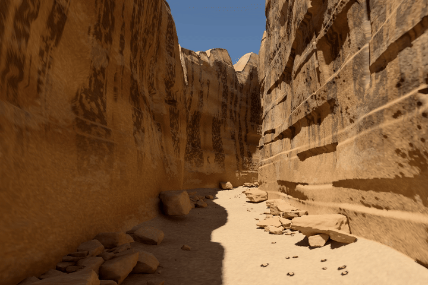

# Sandstone Walk

**A three-dimensional canyon with mobile walking, orbit inspection and native spectral surface-baked lighting.**

The current scene uses a **closed, connected landform**, not freestanding wall sheets. Interior cliffs join irregular rims, exterior outcrops and the alluvial channel; a curved canyon hides the distance naturally instead of using a separate backdrop. Rough joint-cut rockfall and channel gravel are closed meshes with varied shapes and supported placement.



[MP4](media/sandstone-walk-solid.mp4) · [Interior](media/solid-hero.png) · [Orbit](media/solid-orbit.png) · [Release downloads](../../releases/latest) · [Geometry and bake notes](docs/SOLID_GEOMETRY.md)

This six-second, two-shot film is drawn from the shipped geometry, lighting data and GLSL in **native OpenGL ES**. The MP4 contains 144 different 1200 × 800 frames at 24 fps; the 720 × 480 GIF samples the same film at 12 fps. It is not an animated still, image generation, frame interpolation or a browser recording. Actual Three.js browser captures are separately recorded under [`evidence/browser/`](evidence/browser/).

## Run

No bundler, API key, npm install or runtime CDN is required.

```bash
git clone https://github.com/cybrdelic/sandstone-walk.git
cd sandstone-walk
python -m http.server 8000
```

Open `http://localhost:8000` in a current WebGL2 browser. The active compressed mesh/bake buffers total approximately **68.5 MB**. A self-contained HTML is available in [Releases](../../releases/latest), or build it locally:

```bash
python tools/make_standalone.py
```

The output is `dist/Sandstone_Walk_Standalone.html`, including the current mobile controller and all assets. Asset hashes are checked before packaging. `--legacy` reconstructs the original recovery from the preserved `source/legacy_v0_2/scene.json`, original source and unchanged old assets; older releases also remain available.

## Walk and orbit

**Walk** explores the interior; **Orbit** frames the complete landform. The modes remember their own camera poses. **Reference** returns to the original entry camera; **Fit canyon** reframes the full formation.

| Action | Mobile | Desktop |
|---|---|---|
| Walk / strafe | Left analog thumbstick | WASD / arrows |
| Look while walking | Drag the scene with the other finger | Left drag |
| Height | Hold − / + | Q / E |
| Faster movement | Move faster | Shift |
| Orbit | One-finger drag | Left drag |
| Zoom in orbit | Pinch or + / − | Wheel |
| Pan in orbit | Two-finger drag | Right/middle drag or Shift-drag |
| Change mode | Walk / Orbit | O |
| Reframe / reset | Fit canyon / Reference | F / R |

The thumbstick and look finger have separate ownership. Cancelled touches, lost capture, focus loss and mode switches clear held input. Controls respect mobile safe areas, portrait/landscape layouts and a compact Settings drawer. The automatic walking route now reads the regenerated canyon centerline.

Navigation is a **free inspection camera**, not a grounded/collision-tested player character. Improved controls and fewer triangles do not establish a frame-rate guarantee on a physical phone. The resolution selector changes pixel cost, not geometry density.

## What changed in the geometry

The previous scene was an interior rendering set: two zero-thickness walls, a floor sheet and a separate far wall. Those shortcomings became visible in orbit mode. Version 0.3 deliberately changes the model rather than claiming the old topology was physically complete.

The terrain is now one closed volume with exact shared boundaries between its material/bake charts. Rim heights and exterior relief vary across both horizontal directions; the outside is not simply an extrusion of the inside silhouette. Bedding thickness, finite joint cuts, broken patches and alcoves are irregular. Fallen rocks use bounded implicit intersections of joint planes with resolved erosion-like relief, not a low-poly sphere or a few flat bevel faces. Their surfaces are actual geometry.

| Current scene | Count |
|---|---:|
| Triangles | 5,029,800 |
| Vertices | 2,526,592 |
| Material/bake mesh groups | 9 |
| Closed rock components | 963 |
| Native irradiance sample locations | 228,136 |
| Hemisphere samples per location | 256 |
| Spectral bands | 16 |
| Maximum path depth | 10 |

The terrain's actual delivered positions/indices are stitched by **exact matching coordinates**, then checked for zero open boundary edges, consistent winding, a positive volume and a single connected component. Rock components are separately checked for closure and positive volume. Those tests establish mesh integrity, not photogrammetric accuracy, real erosion dynamics or a visual-quality certification.

New native mesh SHA-256: `7522cf1848ef94af2593e4a2d2a9df382df11c2e85e9ac4662a364a107656c79`.

## Lighting

Every changed surface is **freshly rebaked** with the retained native CYBR GEO transport code. The bake traces the complete regenerated mesh; it does not reuse lighting from the rejected sheets. Indirect lighting is sampled in 16 wavelength bands, filtered in linear light and stored on the surfaces. Direct sunlight visibility is evaluated separately with finite-sun rays; the viewer retains the original view-dependent diffuse/specular shader and native sky/display transform.

No photograph is projected into the canyon. There are no hand-colored light probes, hemisphere fill lights or artificial bounce-light rigs. The bake is static: moving the sun or changing the geometry requires another bake. Finite sampling and interpolation still limit small shadow transitions and close-up shading; indirect glossy transport is not fully view-dependent.

## Rebuild and verify

Linux / WSL requires a C++17 compiler with OpenMP. The numerical environment is pinned in `source/requirements-solid.txt`.

```bash
python -m pip install -r source/requirements-solid.txt
python source/rebuild_solid.py --work ./build/solid-work --out . --spp 256 --depth 10 --threads 4
python tools/verify.py
python tools/make_standalone.py
```

The new recipe is `source/solid_geometry.py`; the old native scene generator and recovery orchestrator remain unchanged for historical reproduction. The new bake adapter takes its required triangle count from the validated regenerated layout rather than silently accepting an old mesh. Allow several GB of memory and temporary disk space. Compiler/platform differences can change floating-point bake results; receipts record actual generated identities.

```bash
python -m pip install -r tools/requirements-test.txt
python -m playwright install chromium
python tools/browser_smoke.py
python tools/mobile_controls_smoke.py
python tools/test_solid_browser.py
```

The existing desktop and multi-touch regressions remain active with the deliberately revised mesh counts. The additional scene test captures interior, reverse and orbit cameras and exercises simultaneous thumbstick/look, pinch and pan. It must draw the current geometry, not a screenshot substitute. Touch emulation is not a physical-phone benchmark.

To regenerate the actual moving-camera preview with Mesa/EGL and FFmpeg:

```bash
python tools/render_solid_media.py
```

## Evidence and provenance

[Delivered topology and buffers](evidence/solid_validation.json) · [Geometry construction](evidence/geometry_report.json) · [Native bake](evidence/bake_execution.json) · [Actual browser execution](evidence/browser/report.json) · [Moving-camera frame hashes](evidence/solid_media.json)

Older recovery and mobile-control reports are retained as **historical evidence**, not relabeled as tests of this geometry. The immutable old assets remain available for `--legacy` reconstruction, so the repository contains more bytes than the active viewer downloads.

This is a finite authored terrain study with a closed base. It is **not a scanned location, calibrated geological simulation or an exact reconstruction of the original still**. Closing the model and revising its rock shapes are substantive fixes; they do not by themselves certify photorealism.

## License

GPL-2.0-only; see [LICENSE](LICENSE). Three.js r180 retains its MIT notice. Existing CC0 asset attribution remains under `source/cybr-geo/examples/desert_hot_springs/assets/`. See [third-party notices](THIRD_PARTY_NOTICES.md).
