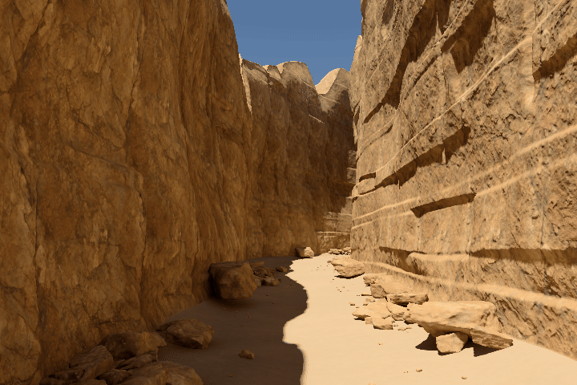

# Sandstone Walk

A navigable sandstone canyon built with CYBR GEO and rendered in Three.js.

**0.5.0: photographic surface detail, native screen pixels and stationary HDR antialiasing.**
The closed canyon geometry, mobile thumbstick and orbit camera are retained.



[4K browser render](evidence/detail/hero_4k.png) · [Before / after](evidence/detail/comparison.jpg) ·
[Rendering implementation](docs/DETAIL_RENDERING.md) · [Release downloads](https://github.com/cybrdelic/sandstone-walk/releases/latest)

## Run

Download a standalone HTML from Releases and open it in a current WebGL2 browser.
The **full** version embeds 4K material maps. The **compact** version embeds 2K
maps, with identical geometry and rendering/control code. Neither needs a CDN.
WebGL2, floating-point color-buffer support and `DecompressionStream` are required.

Or serve this repository:

```bash
python -m http.server 8000
```

Open `http://localhost:8000/`. The split application loads the same assets and
4K material maps as the full standalone. To rebuild the current offline viewer:

```bash
python tools/make_standalone.py
python tools/make_standalone.py --texture-size 2048 --out dist/Sandstone_Walk_Compact.html
```

## Controls

| Action | Touch | Mouse / keyboard |
| --- | --- | --- |
| Walk and strafe | Left thumbstick | WASD / arrows |
| Look while walking | Drag with the other finger | Left drag |
| Change height | Hold − / + on the right | Q / E |
| Move faster | Faster toggle | Shift |
| Orbit the canyon | Orbit button, then drag | O, then left drag |
| Orbit zoom / pan | Pinch / two-finger drag | Wheel / right-drag |
| Frame the whole canyon | Fit canyon | F in orbit |
| Original camera | Reference | R |

Switching modes restores separate walk/orbit poses. Pointer cancellation and
focus loss clear held movement. This is a **free inspection camera**, not a
collision or ground-following character controller.

Settings includes native/1.5× native/1× CSS/0.75× CSS pixel profiles, photographic
detail and relief toggles, exposure, material diagnostics and **Capture 4K PNG**.
A 3× display requests nine times the former one-pixel-per-CSS-pixel raster count.
The 8,388,608-pixel interactive safety cap is shown when active; there is no hidden
adaptive resolution decrease. The 4K capture performs eight fresh samples at a
3840-pixel long edge (3840 × 2560 for the reference view), then restores interaction.

## What changed

Two **4096² photographic material sets** supply registered diffuse, OpenGL normal,
roughness, height and AO. Their metre-space triplanar projection replaces smooth
noise-only fine detail without changing positions or triangle indices. Full mip
chains and up to 16× anisotropy handle oblique surfaces. Bounded parallax adds
material relief, not new terrain silhouettes.

The renderer accumulates eight stationary subpixel samples in **linear HDR** before
the native color transform. Pose, projection and material changes reset that view's
history; no image reprojection is used. Broad and near 4096² geometric depth maps
replace coarse vertex sun visibility. Light-space texel snapping and receiver-plane
bias reduce shimmering and slope acne.

All **5,029,800 triangles / 2,526,592 vertices**, the native sky and the v0.4 spectral
macro-bounce arrays remain unchanged. The photographic receiving material is
mean-matched toward that bake. It is **not a newly rebaked full scanned-material
transport solution**; fine AO, parallax and local shadowing are approximations.
The canyon remains authored procedural geometry, not photogrammetry. Geometry,
low-frequency indirect light and raster-shadow limitations remain visible in
some views. [Detailed methods and limits](docs/DETAIL_RENDERING.md).

## Sources and memory

The materials are CC0 [Rock Face 03](https://polyhaven.com/a/rock_face_03) and
[Sandy Gravel](https://polyhaven.com/a/sandy_gravel) from Poly Haven. Original source
URLs, byte sizes and hashes are in [`source/detail_sources.json`](source/detail_sources.json).
Code remains under the repository's GPL license; Three.js retains its MIT notice.

The four 4K RGBA textures occupy approximately **341 MiB with mipmaps**, before
geometry, shadows and HDR targets. The 2K maps occupy approximately **85 MiB**.
WebP reduces transfer size, not GPU memory. CPU image pixels and compressed scene
strings are released after upload/decompression. This quality upgrade is **not
a physical-phone frame-rate guarantee**.

## Verification and reproduction

```bash
python -m pip install -r tools/requirements-test.txt
python -m playwright install --with-deps chromium
python tools/fetch_detail_sources.py
python tools/prepare_detail_textures.py
python tools/build_detail.py
python tools/verify_detail.py
python tools/verify.py
python tools/test_material_field.py
python tools/browser_smoke.py
python tools/mobile_controls_smoke.py
python tools/test_detail_browser.py
```

Current photographic-detail captures and reports are under `evidence/detail/`.
The browser test independently observes actual terrain draw calls, checks all
source geometry, exercises stationary accumulation/reset, records the bright HDR
solar disk, verifies an emulated DPR-3 raster, and invokes the real 4K exporter.
The 4-second camera loop contains 48 distinct rendered frames at 720 × 480 / 12 fps,
with two subpixel samples per frame; it is not an animated still or frame interpolation.

`--in-memory` is an explicitly labelled local asset-transport alternative for
restricted environments; normal CI tests the split HTTP application. Tests of the
unchanged native material field do not imply that the additional photographic
material has been rebaked. Touch emulation is not a physical-device benchmark.

Earlier `evidence/materials/`, `evidence/solid_ci/` and the older `sandstone-walk`
media remain historical evidence for their original releases. The original recovery
still has a separate `python tools/make_standalone.py --legacy` path; current
standalone output intentionally includes the newer renderer and controls.
