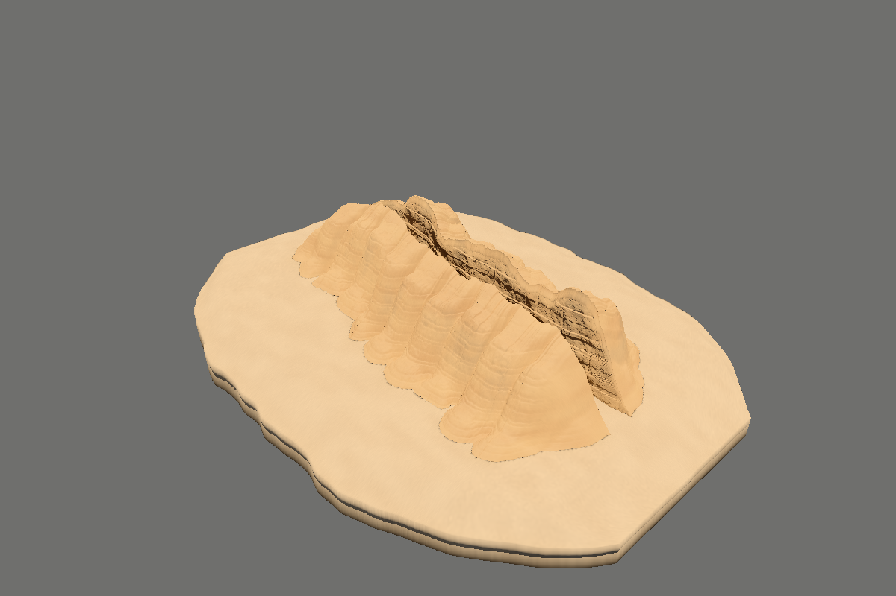

# Sandstone Walk

**A real 3D canyon with closed rock masses, spectral surface-baked lighting, mobile walking and orbit inspection.**


[Interactive standalone / source downloads](../../releases/latest) · [MP4](media/sandstone-walk.mp4) · [Interior still](media/hero.png) · [Orbit still](media/orbit.png)

## Geometry repair — 0.3.0

The earlier scene consisted of open canyon wall sheets, an open floor and a separate far-end backdrop. Orbit navigation exposed their lack of thickness. This release replaces those surfaces, rather than hiding their backs or projecting the original picture.

The west and east formations now have connected cliff faces, irregular caprock rims, weathered shoulders, incised outer slopes and buried closing surfaces. The alluvial terrain is also a closed volume. Bedding recesses and finite joint/spall shapes are actual vertices. The far backdrop is removed; the passage continues around its bend. 1,150 independent fragments and blocks are settled into the evaluated floor. Candidate exclusion limits obvious rock overlaps; it is not a rigid-body settling simulation.

The new scene contains **4,611,262 triangles and 2,307,937 vertices**. It is a new authored formation, not the old mesh decimated or the original photograph reconstructed exactly. All three large solids have zero boundary edges, consistent winding and positive signed volume. Cross-section checks reject folded cliff/crest profiles. The terrain grid is monotone, without folded-over apron cells.



The lighting has been **rebaked against this new geometry**. The native CYBR GEO tracer evaluated 145,287 actual surface locations at 256 hemisphere samples each, using 16 spectral bands and depth 10. Separate finite-sun queries recorded 26,659,904 rays. No bake from the old walls is reused. Sandstone reflectance now has restrained weathering instead of the previous high-contrast camouflage-like varnish. Reflectance spectra remain authored RGB-anchor reconstructions, not measured minerals.

## Run

```bash
git clone https://github.com/cybrdelic/sandstone-walk.git
cd sandstone-walk
python -m http.server 8000
```

Open **http://localhost:8000**. The split viewer fetches approximately **73.1 MB** of compressed geometry and lighting. Three.js r180 is vendored; no runtime CDN, npm install or API key is needed. File lengths and, where available, SHA-256 hashes are checked during loading.

Download the single-file viewer from [Releases](../../releases/latest), or build the current version:

```bash
python tools/make_standalone.py
```

The current controls and all current scene assets are embedded. The earlier scene remains in the [v0.2.0 release](../../releases/tag/v0.2.0). The `--legacy` reconstruction command belongs to that checkout; it must not be run against these replacement assets.

## Mobile and desktop navigation

**Walk:** left-thumb analog stick to move; drag the scene with the other finger to look simultaneously. Hold − / + for height. Use the speed toggle for faster movement. On desktop use WASD/arrows, drag to look, Q/E for height and Shift for speed.

**Orbit:** one-finger drag to rotate, pinch to zoom and two-finger drag to pan. Desktop supports wheel zoom and right/middle or Shift-drag panning. **Fit canyon** reframes the full geometry. **Reference** returns to the entrance. Walk and Orbit keep separate camera poses. O switches navigation, F fits Orbit, R resets.

Safe-area-aware portrait/landscape layouts, the mobile Settings drawer, pointer ownership and cancellation/focus-loss cleanup are retained. This remains a free inspection camera: no collision or ground-following character controller. Geometry density is lower than the previous release, but no physical-phone FPS or memory guarantee is claimed.

## Reproduce the new geometry and bake

Use Python 3.13 and GCC with C++17/OpenMP on Linux or WSL:

```bash
python -m pip install -r source/requirements-volume.txt
python source/rebuild_volume.py --workspace ./work-volume --project . --spp 256 --threads 4 --render --film
bash tools/encode_volume.sh
python tools/verify_volume.py --evidence
python tools/make_standalone.py
```

The build records the geometry, input samples, native source and baker binary hashes. The native triangle loader is compiled with the actual regenerated triangle count. The material hook is opt-in; the original CYBR GEO material implementation remains the default for the retained historical pipeline.

For browser and multi-touch checks:

```bash
python -m pip install -r tools/requirements-test.txt
python -m playwright install chromium
python tools/browser_smoke.py
python tools/mobile_controls_smoke.py
```

`CHROMIUM_PATH` selects a system browser. Tests use the current scene totals, not the retired 8.1M count, and preserve actual canvas captures and graphics errors. Browser touch emulation is not physical-device benchmarking.

## Evidence and limits

[Geometry and asset validation](evidence/formation/validation.json) · [Native bake](evidence/formation/bake.json) · [Geometry construction](evidence/formation/design.json) · [Rendered views](evidence/formation/render_execution.json) · [Animation receipt](evidence/formation/media.json)

The GIF/MP4 contain actual moving-camera renders of the delivered geometry and shaders, not an animated still, generative imagery or frame interpolation. Native GLES output is identified separately from Chromium captures. Earlier `evidence/browser_ci/` and `evidence/mobile_controls_ci/` records describe the 0.1/0.2 releases; new browser qualification, when present, is under `evidence/formation/browser/` and `evidence/formation/mobile/`.

This is an **authored, finite terrain study**, not a surveyed site, a geophysical erosion simulation or an unlimited world. The terrain has a finite closed underside visible from outside the environment. Bedrock/apron overlaps below ground are intentional. Cross-section gates sample all mesh rows and row midpoints, not a formal exhaustive triangle-intersection proof. Surface-lightmap interpolation still limits close-up GI detail. The static sun/scene requires rebaking after geometry or illumination changes; indirect glossy light is not fully view-dependent. No claim of pixel identity with the original still or an external “AAA” certification is made.

## License

GPL-2.0-only for this project and CYBR GEO-derived code. Vendored Three.js retains its MIT license. Asset attribution remains under `source/cybr-geo/examples/desert_hot_springs/assets/`. See [LICENSE](LICENSE) and [third-party notices](THIRD_PARTY_NOTICES.md).
