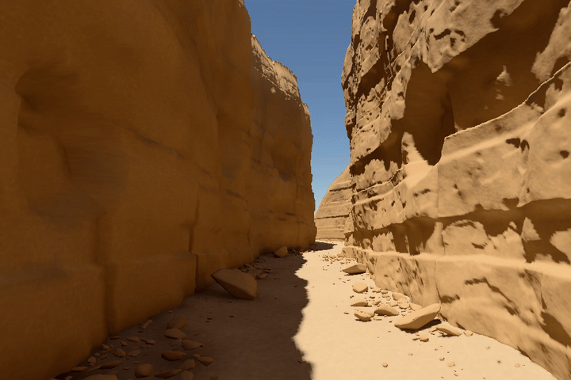

# Sandstone Walk

**A walkable Three.js canyon with native spectral surface-baked lighting.**

Layered sandstone, jointed slabs, rockfall fans and an alluvial floor, preserved from a procedural CYBR GEO scene. The browser draws the original **8,108,728 triangles** and samples the precomputed lighting while the camera moves freely.



[Higher-quality MP4](media/sandstone-walk.mp4) · [Full-resolution still](media/hero.png) · [Download standalone viewer](../../releases/latest) · [Technical notes](docs/ARCHITECTURE.md)

The preview is a six-second moving-camera loop rendered from the shipped geometry, bake and GLSL. The MP4 contains 144 distinct 1200 × 800 frames at 24 fps; the GIF uses 72 of those frames at 720 × 480 and 12 fps. It is a native OpenGL ES execution of the viewer shaders, **not a browser recording**, image-generated animation, projected photograph or interpolated video.

## Run

No bundler, npm dependencies, API key or external CDN is needed to view the scene. Clone the repository and serve it over HTTP:

```bash
git clone https://github.com/cybrdelic/sandstone-walk.git
cd sandstone-walk
python -m http.server 8000
```

Open **http://localhost:8000** in a current WebGL2 browser. The first load fetches approximately **92.8 MB of compressed geometry and lighting**. The JavaScript checks asset lengths and, on secure contexts such as localhost, SHA-256 hashes before uploading buffers.

For a single-file offline copy, download the standalone HTML from [Releases](../../releases/latest), or reassemble it from the repository:

```bash
python tools/make_standalone.py
```

This writes `dist/Sandstone_Walk_Standalone.html` and verifies that it is byte-identical to the preserved recovery delivery. It is approximately 124.4 MB. The split web version avoids placing that oversized HTML in Git and loads the same geometry, bake and shaders.

### Controls

| Action | Input |
| --- | --- |
| Look around | Drag |
| Move | WASD or arrow keys; on-screen arrows for touch |
| Move vertically | Q / E |
| Faster movement | Left Shift |
| Step forward or backward | Mouse wheel |
| Reset the camera | R or **Reference view** |
| Follow the canyon route | **Walk through** |
| Inspect lighting | Full, direct, indirect, normals or sun visibility |
| Adjust display | Exposure, pixel resolution and interface toggle |

Movement is a free-camera inspection controller. It does not perform collision detection. The resolution selector changes pixel shading cost, not mesh density. All source triangles are retained, so GPU memory and performance requirements are substantial; no mobile or frame-rate guarantee is made.

## Lighting and geometry

The scene is generated by the retained CYBR GEO recipe rather than a scanned mesh or image-to-3D service. The native bake uses the recovered **16-band spectral transport code**, sampling **414,439 surface locations** with **256 hemisphere samples per location** and a maximum path depth of **10**. Separate finite-sun visibility queries use the full canyon mesh.

The browser interpolates surface-bound indirect radiance and evaluates view-dependent direct diffuse and specular response. It also samples the native procedural sky and uses the recovered white balance and display transform. There are **no reference-image projections, hand-painted irradiance probes, hemisphere fill lights or fake bounce-light rig** in this version.

| Preserved scene | Count |
| --- | ---: |
| Triangles | 8,108,728 |
| Vertices | 4,072,674 |
| Mesh groups | 7 |
| Spectral bake sites | 414,439 |
| Solar visibility rays recorded by the bake | 37,452,960 |

The native source-mesh SHA-256 is `50fbfa563abe246a9049279274a1cea710be5b38f423ccdc6ab6ef731d27156a`. Publication checks compare **each shipped position buffer and complete index ordering** against the recovery's preserved hashes. There is no topology reduction or replacement geometry in the web package.

## Repository layout

```text
index.html               Browser entry point and controls
web/                     Viewer, GLSL, scene manifest and compressed assets
  vendor/                Pinned Three.js r180 bundle with its license notice
source/                  Native bake, scene generation and original packaging source
  cybr-geo/              Retained CYBR GEO source and asset provenance
tools/                   Array validation, browser smoke test, media rendering and packaging
media/                   Animated GIF, MP4 and freshly rendered stills
evidence/                Geometry, bake, shader, media and publication receipts
docs/                    Architecture, reproduction and original recovery notes
```

## Rebuild and test

Viewing the committed build does not require the Python rendering dependencies. To validate the arrays and source identity:

```bash
python -m pip install -r source/requirements.txt
python tools/verify.py
node --check web/app.js
node --check web/bootstrap.js
```

To regenerate the native geometry and lighting on Linux or WSL, use GCC with C++17 and OpenMP support:

```bash
python source/rebuild.py --workspace ./work --out ./rebuilt --spp 256 --threads 4 --depth 10
```

The native builder rejects a regenerated mesh that does not match the original mesh hash. Allow several GB of temporary disk space. The retained recovery notes distinguish historically executed stages from the orchestration wrapper; compiler and dependency differences can affect numerical bake output. See [reproduction notes](docs/REPRODUCING.md).

To render the moving-camera preview from the committed bake with Mesa/EGL and FFmpeg:

```bash
python tools/render_preview.py --width 1200 --height 800 --frames 144 --fps 24
bash tools/encode_preview.sh
```

Each frame is drawn from a new 3D camera pose using all 8.1 million triangles. This does not rerun spectral path tracing for every animation frame: it uses the existing native bake, just as the interactive viewer does.

A real browser test is also supplied:

```bash
python -m pip install playwright
python -m playwright install chromium
python tools/browser_smoke.py
```

Set `CHROMIUM_PATH` to use a system Chromium executable. The test exercises startup, geometry totals, rendered output, camera movement, reset and lighting-mode switching. It fails rather than silently substituting a static screenshot.

## Validation and limits

[Publication validation](evidence/publication_validation.json) confirms buffer integrity, original positions/topology, finite values and unchanged shaders. [Preview rendering](evidence/preview_render.json) records every camera pose and frame hash; [media verification](evidence/media_verification.json) verifies the delivered GIF and MP4. The initial native bake evidence is preserved separately in [recovery verification](evidence/recovery_verification.json).

Local native GLES rendering completed with zero graphics errors. The local Chromium attempt was blocked by the environment's administrator policy; that failure is recorded in [local browser evidence](evidence/local_browser_attempt.json), not described as a successful browser test. GitHub Actions runs the separate browser test on its own runner; its workflow result is the authority for that execution.

This is a **static surface bake**, not dynamic global illumination or real-time spectral path tracing. Finite bake resolution, filtering and vertex interpolation can soften shadow boundaries and close-up material detail. Indirect glossy lighting is not fully view-dependent. The sun and scene geometry cannot move without rebaking. The result is not claimed to be a pixel-identical match to the original offline still or an externally certified visual-quality benchmark.

## License

CYBR GEO-derived code and this project are distributed under **GPL-2.0-only**; see [LICENSE](LICENSE). The vendored Three.js r180 code retains its MIT notice. Original asset provenance and attribution are retained under `source/cybr-geo/examples/desert_hot_springs/assets/`. See [third-party notices](THIRD_PARTY_NOTICES.md).
